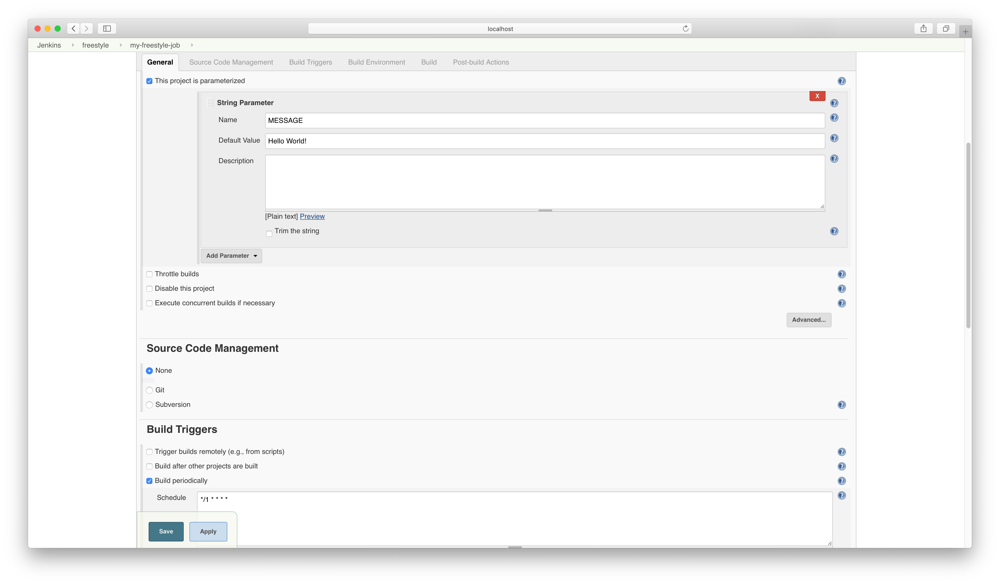
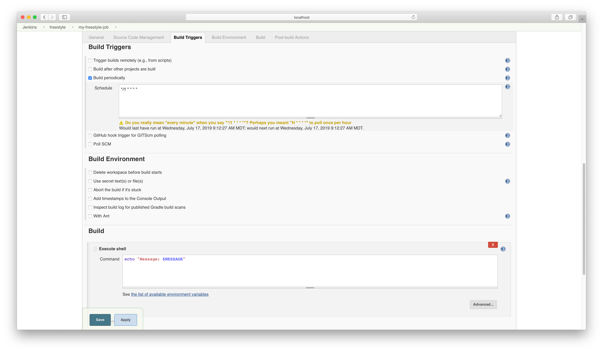
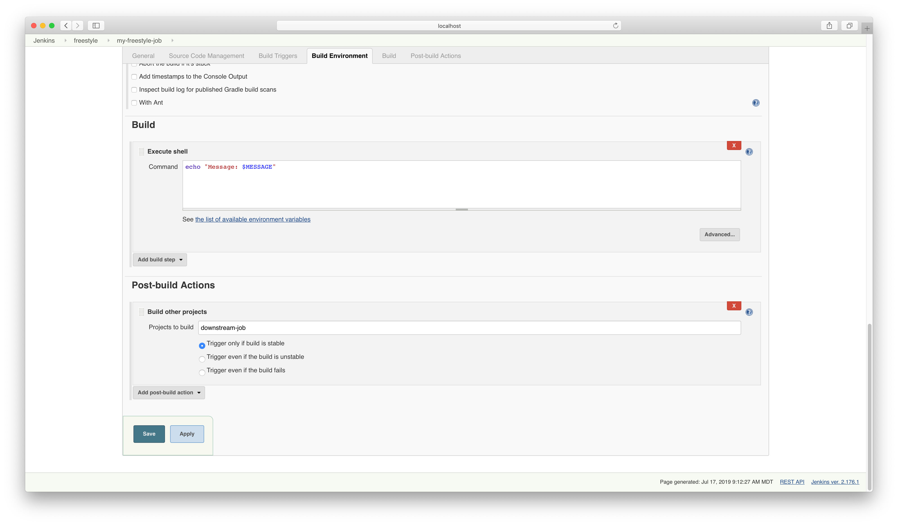

# Key CI/CD/Jenkins Concepts and their Usage

## Configuring Build Triggers and Steps for a Job

1. Add a default value for the build parameter named `MESSAGE` e.g. `Hello World!`.
2. Create a build trigger that builds the project every minute.
3. Add a build step that executes the shell command `echo "Message: $MESSAGE"`. The message is value of the parameter.
4. After a minute the first execution should have been triggered. Check the log output of the build and find the rendered message.
5. Create another freestyle project named `downstream-job` in the same folder.
6. Configure the initial job to execute the `downstream-job` if it was stable.

<details><summary>Show Solution</summary>
<p>

Modify the existing build parameter.



Add the cron build trigger and the build step.



The output render the interpolated value of the `echo` command.

```bash
Started by timer
Running as SYSTEM
Building in workspace /Users/bmuschko/.jenkins/workspace/freestyle/my-freestyle-job
[my-freestyle-job] $ /bin/sh -xe /var/folders/02/3dgzjkqj4kz0g7lnrk0w93c00000gn/T/jenkins3548490840940668236.sh
+ echo "Message: Hello World!"
Message: Hello World!
Finished: SUCCESS
```

Create a new job in the same folder.


Configure the downstream job from the initial job.



The downstream job indicates the upstream job.


</p>
</details>