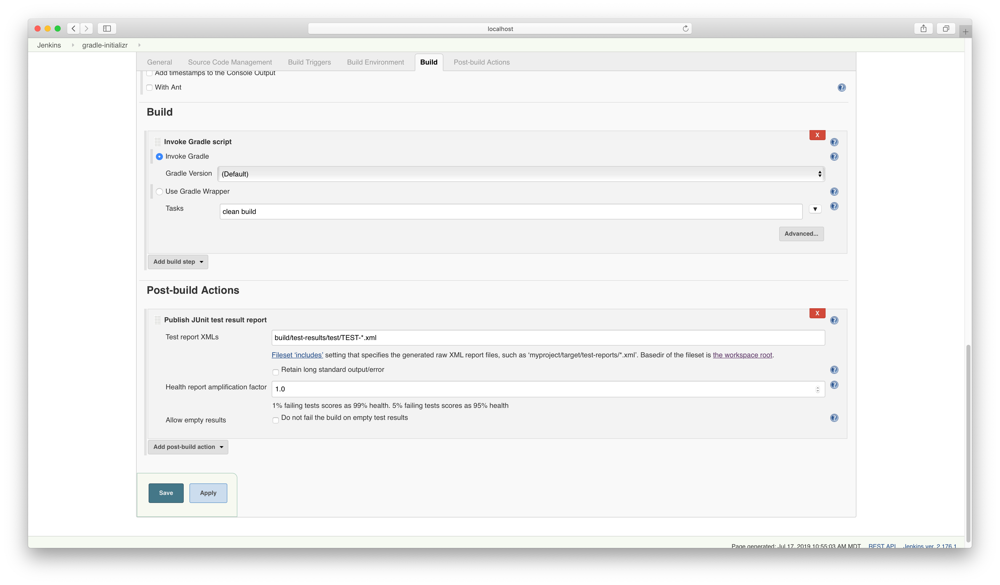
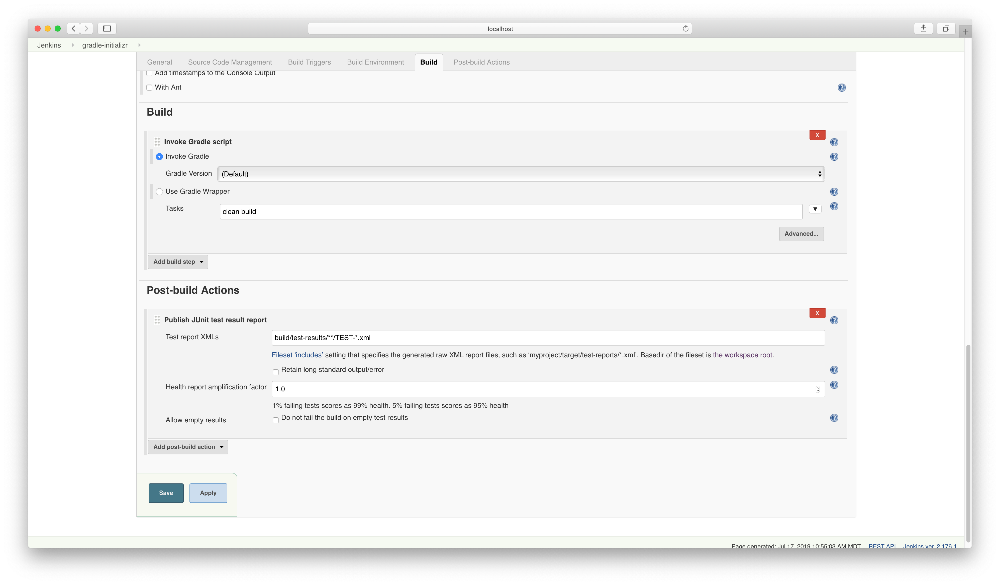
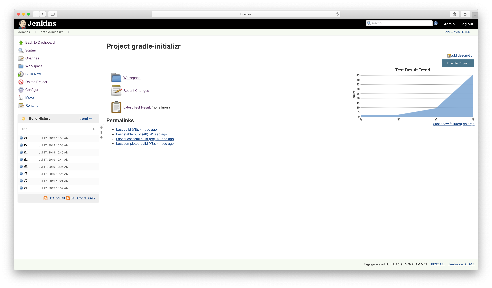
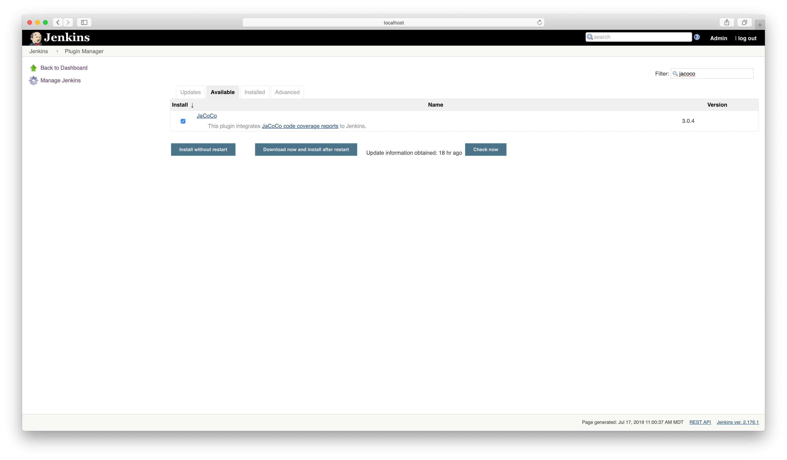
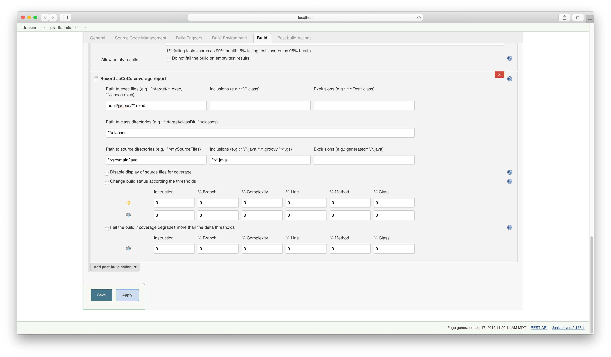
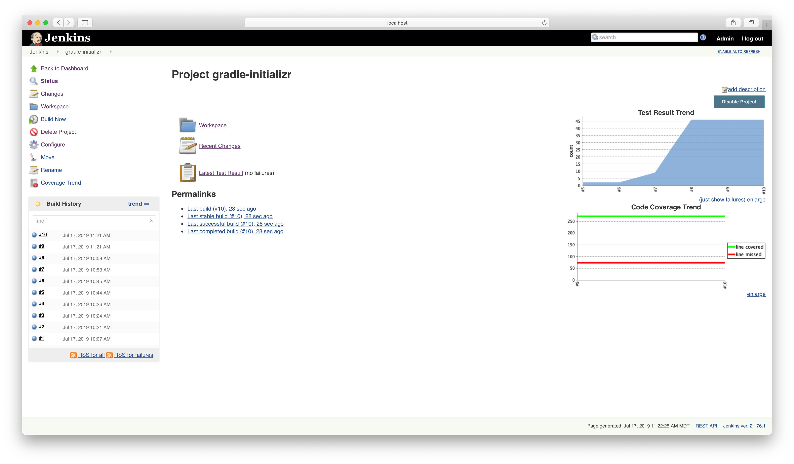
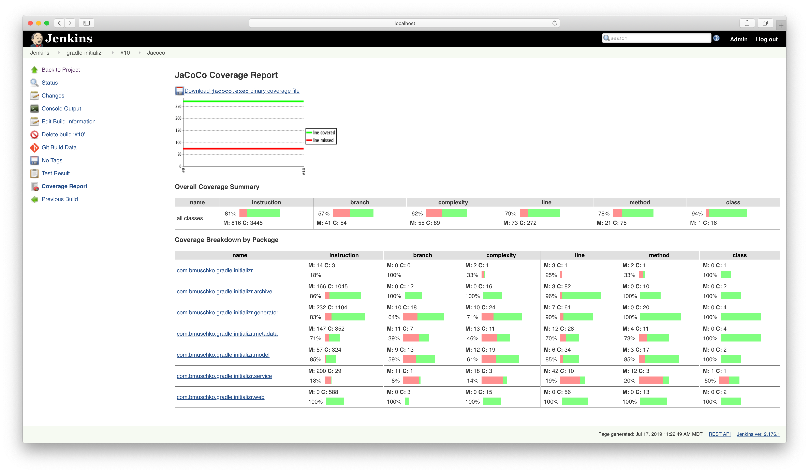

# Key CI/CD/Jenkins Concepts and their Usage

## Displaying JUnit and JaCoCo Test Results

1. Configure the `gradle-initializr` project to parse the JUnit XML results for unit test. The files can be found in the directory `build/test-results/test`.
2. Execute the build twice to generate a graph. Have a look at the executed tests in the test results.
3. Include all test results (unit and integration tests) in the reporting.
4. Have a look at how the test result trend changes.
5. Install the JaCoCo plugin.
6. Reconfigure the Gradle build step to also generate JaCoCo reports: `clean build jacocoTestReport jacocoIntegrationTestReport`.
7. Add a post-build action for publish the JaCoCo reports. Use the following path to look for results: `build/jacoco/**.exec`.
8. Execute the build twice to generate a graph. Have a look at the code coverage results.

Show Solution

Publish the JUnit reports by pointing to the exact directory containing the XML files.

After executing the build twice you will see a test result trend graph.

Publish the JUnit reporting by using a wild card.

The trend changes accordingly.

Install the JaCoCo plugin.

Change the task list executed by the Gradle build step.

Configure JaCoCo reporting.

The JaCoCo coverage trend renders after executing the build twice.

You can drill into the details of the report.

