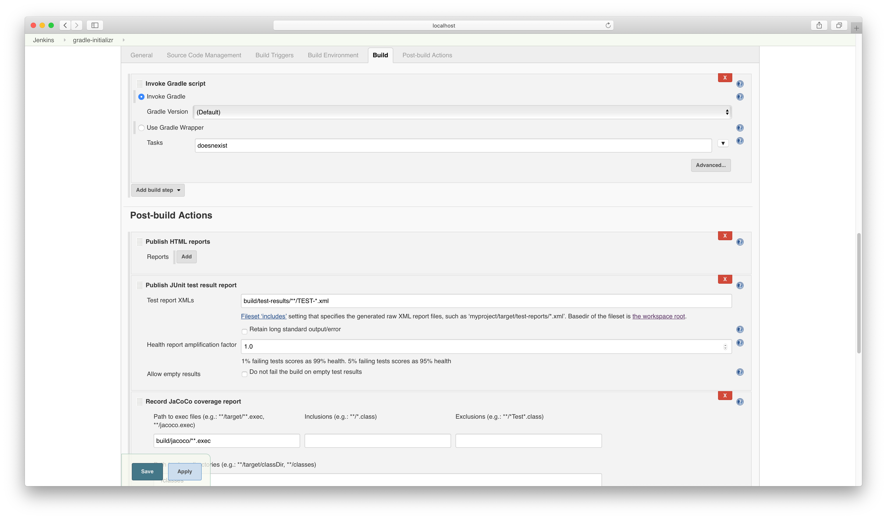
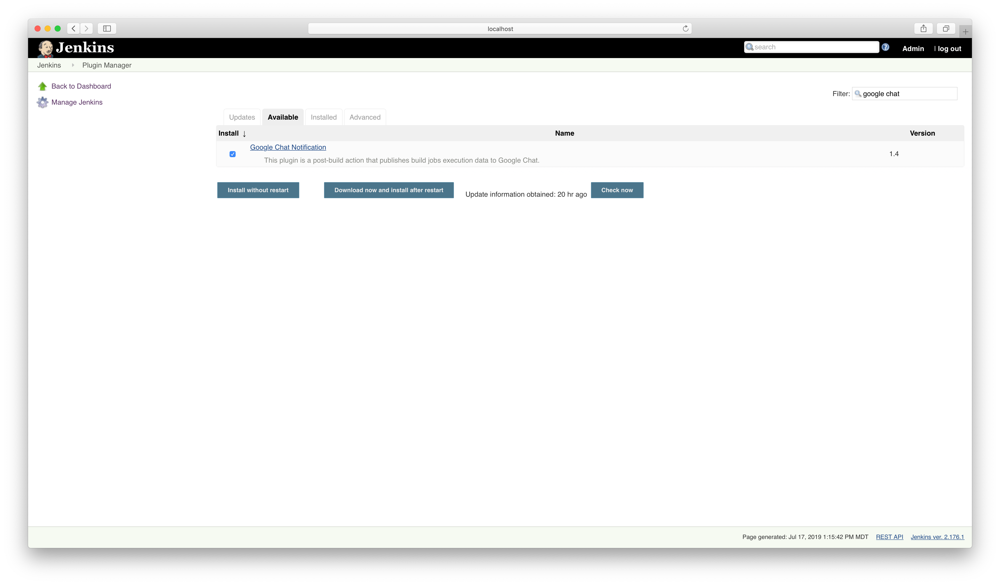
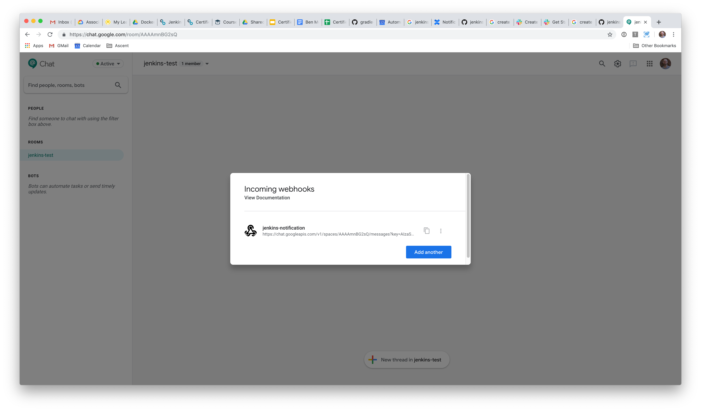

# Key CI/CD/Jenkins Concepts and their Usage

## Notifying the team upon a broken build

1. Change the list of Gradle tasks to `doesnotexist` to emulate a failure. The build will fail as the task doesn't exist in the build script.
2. Install the Google Chat plugin.
3. Create a new chat room in Google Chat named `jenkins-test`.
4. For the chat room configure the webhook.
5. Configure the job to send a notification whenever the job fails. Use the webhook generated on Google Chat.
6. Execute the build. The build should fail and send a notification to the chat room.

Show Solution

Change the list of Gradle tasks first.

Find the plugin and install it.

Add a new chat room.

For the chat room, click the little cog icon and create a new webhook.

Enter an appropriate name for the webhook.

Copy the generate webhook URL to the clipboard.

In the Jenkins job, create a new Google Chat notification. Add the webhook URL and provide a name.

Run a build. It should fail and send a new message to the chat room.

