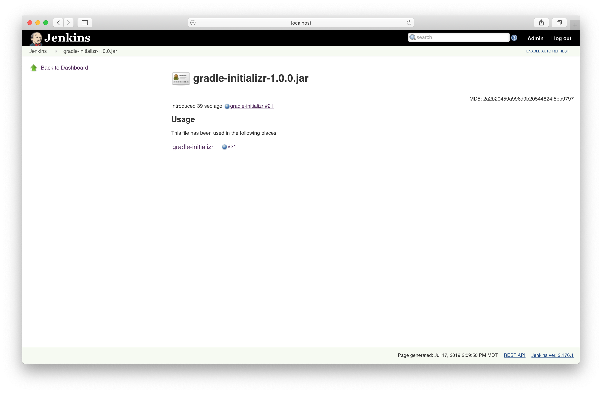
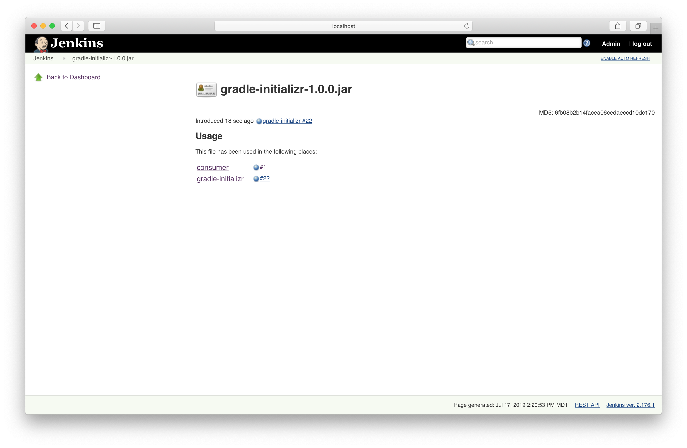

# Key CI/CD/Jenkins Concepts and their Usage

## Storing and Fingerprinting Artifacts

1. Create a post-build action for archiving JAR file with the pattern `build/libs/*.jar`.
2. Execute the build. The build should list the artifact `gradle-initializr-1.0.0.jar`.
3. Have a look at the recorded fingerprints of this build.
4. Render the MD5 hash of the artifact and the usage of the artifact.
5. Install the Copy Artifacts plugin.
6. Create a downstream job named `consumer`.
7. Configure the downstream job to use the artifact produced by the upstream job.
8. Run the the build for the job `gradle-initializr`.
9. Have a look at the fingerprints of the downstream job.

Show Solution

In the job configuration, archive the artifact produced by the build. Check the box for generating fingerprints.

Execute the build and find the archived artifact.

Have a look at the details of the fingerprinting.

Install the Copy Artifacts plugin.

Trigger the downstream job upon success.

Copy artifacts from the upstream job.

You can see the full usage of the artifact in upstream and downstream jobs.

