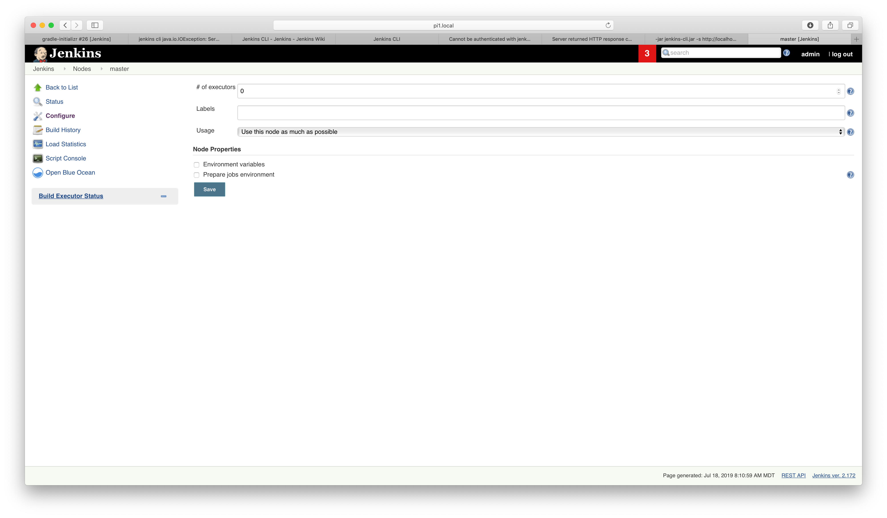
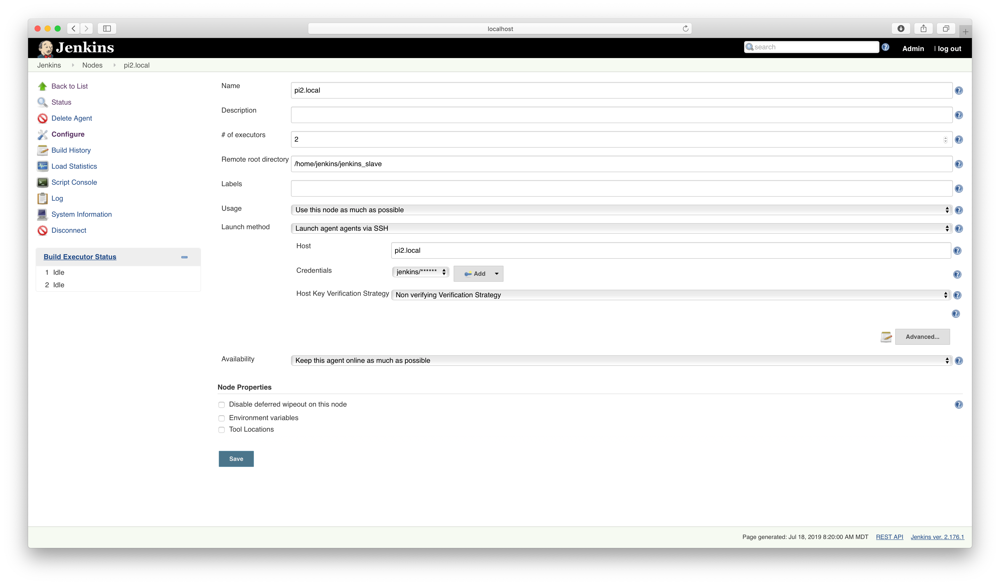
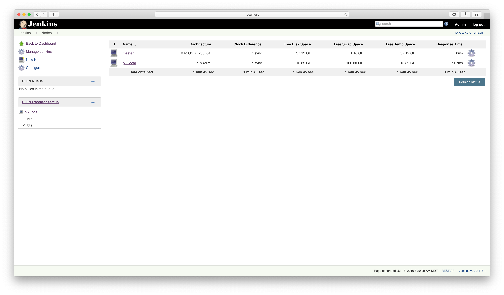
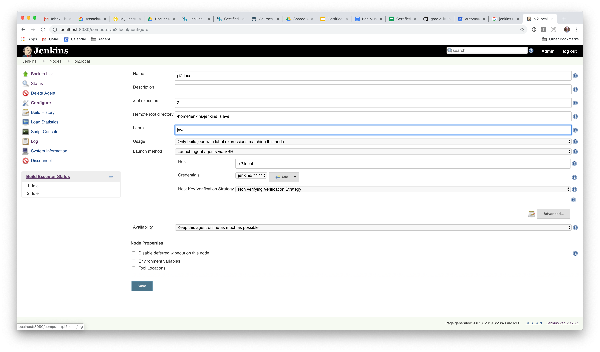
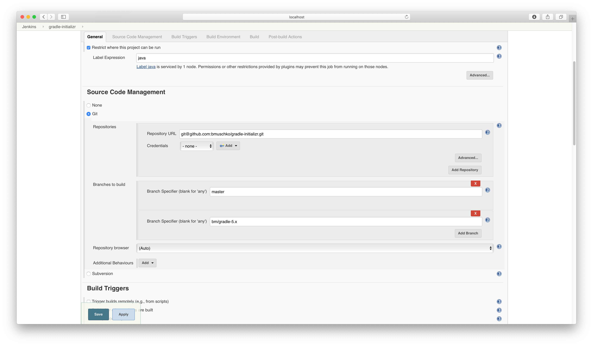
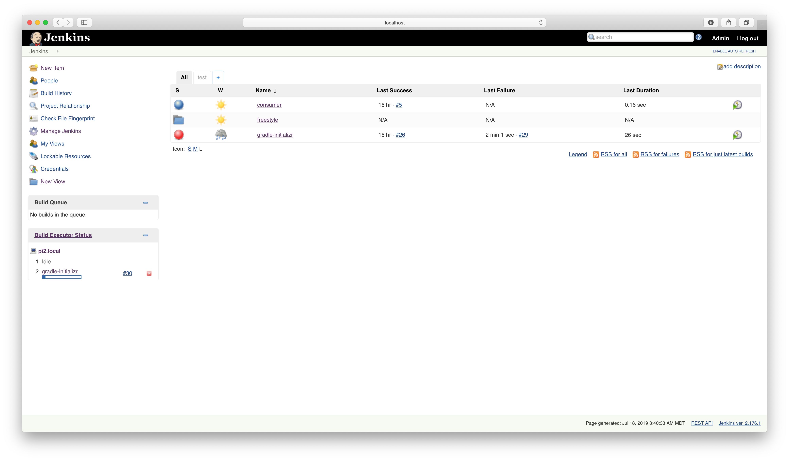
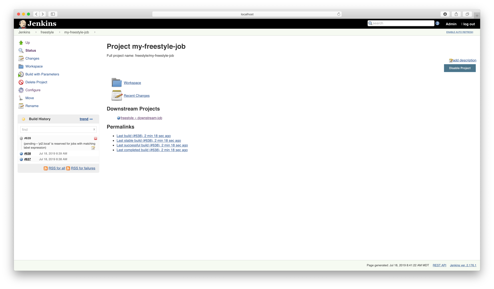

# Key CI/CD/Jenkins Concepts and their Usage

## Configuring and executing jobs in a distributed build

1. Go to "Manage Jenkins" > "Manage Nodes". You should see a single `master` node.
2. Configure the `master` node by setting the # of executor value to 0. That will take care of never using the `master` for job workload.
3. Have other physical or virtual machines ready that can act as agent nodes. Log into the machine as `root` user and create a new user named `jenkins` with the command `useradd -d /var/lib/jenkins jenkins`. From the `master` node, copy the contents of the `id_rsa.key` file to the clipboard. Paste the contents of the clipboard to the file `/var/lib/jenkins/.ssh/authorized_keys`.
4. Add new nodes by clicking "New Nodes". Enter an appropriate name and select the option "Permanent Agent". Use the remote directory `/home/jenkins/jenkins_slave` and set the # of executors to 2. Enter the host and provide credentials by selecting "SSH Username with private key". To keep things easy select "Non verifying Verification Strategy".
4. Trigger a build. You should see that the build is only executed on the agent and not the `master` node.
5. Add at least one more agent.
6. Trigger a build. You should see that the build can be executed on any of the agents.
7. Configure one of the agents to only build jobs with a specific label e.g. `java`. Change the "Usage" field to "Only build jobs with label expressions matching this node".
8. Configure the `gradle-initializr` job and assign the label `java`.
9. Trigger a build of the `gradle-initializr` job. It is only executed by the dedicated agent.
10. Trigger other jobs that do not have the label `java` assigned to them. They are waiting for an agent that can execute the build.

Show Solution

Configure the `master` node.

Add a new agent node.

You will see that the `master` node isn't even listed anymore in the executor overview.

Reconfigure the agent node to only build jobs with a specific label.

Reconfigure the job to only use agents that can handle a specific label.

A build of the job is now only handled by an agent with the assigned label.

Other jobs sit in a queue waiting for an agent that can handle the execution criteria.

