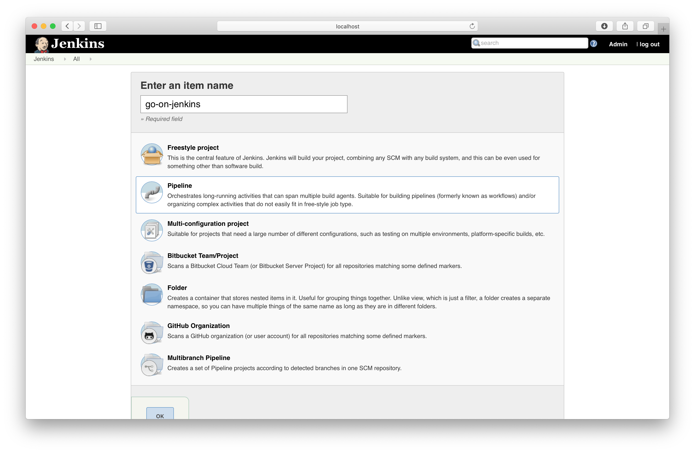
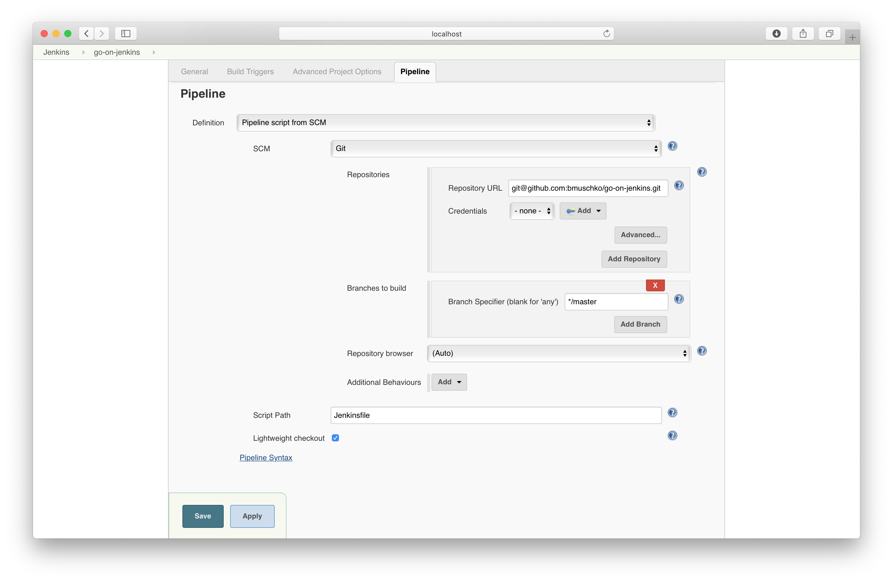

# Building Continuous Delivery (CD) Pipelines

## Writing a basic Jenkinsfile

1. Create a new GitHub repository named `go-on-jenkins`.
2. Create a new `Jenkinsfile` in the root directory of the repository as well as a simple `main.go` file. The main function just prints "Hello World!". Initialize the project via Go Modules.
3. Commit the files and push them to the remote repository.
4. Set up a new pipeline job for this repository in Jenkins.
5. Install the Jenkins Go plugin.
6. Configure the latest Go runtime as global tool.
7. Enhance the `Jenkinsfile` based on the following requirements. The Jenkinsfile should use the declarative syntax.
    7.1 The job can run on all agents.
    7.2 The job sets the environment variable `GO111MODULES=on`.
    7.3 The job uses the Go runtime from the global tool definition.
    7.4 The job specifies one build stage named "Build". The build stage executes the shell command `go build`.

<details><summary>Show Solution</summary>
<p>

Create a new job.



Configure the appropriate SCM.



Install the Go plugin.


Configure a Go runtime as global tool.


The final `Jenkinsfile` looks similar to the solution below.

```groovy
pipeline {
    agent any
    tools {
        go 'go-1.12'
    }
    environment {
        GO111MODULE = 'on'
    }
    stages {
        stage('Build') {
            steps {
                sh 'go build'
            }
        }
    }
}
```

A build of the job installs the Go runtime and executes the build step.


</p>
</details>