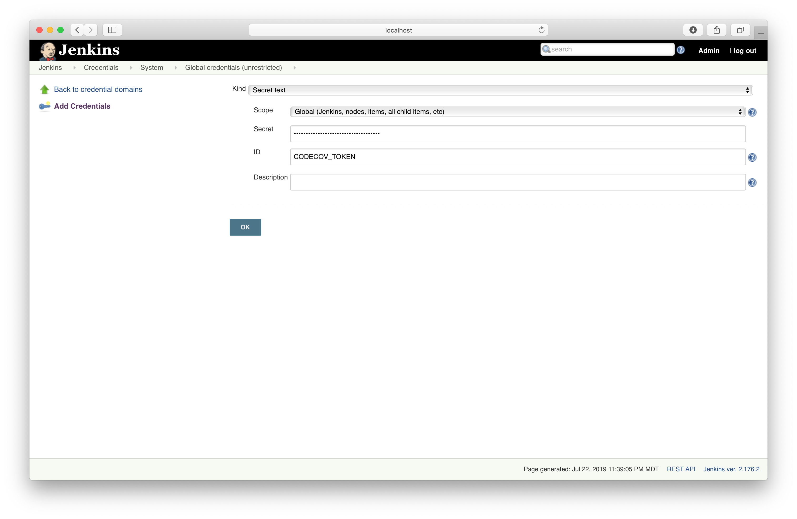

# Building Continuous Delivery (CD) Pipelines

## Enhancing a pipeline with advanced features

We'll want to enhance the pipeline by additional stages and implement a release workflow. The project is going to use an external tool called GoReleaser to publish cross-compiled artifacts to GitHub Releases. The binaries should only be released if the commit has been tagged.

1. Add stage named `Test` that executes the Go `test` command.
    * Add a build step that runs the shell command `go test ./...`.
    * Generate code coverage metrics by adding the option `-coverprofile=coverage.txt` to the build step.
    * Publish the code coverage metrics to CodeCov by sending a curl command `curl -s https://codecov.io/bash | bash -s -`.
    * Create an account on CodeCov, determine the CodeCov token (aka Repository Upload Token) and set it up as credential in Jenkins.
    * Retrieve the credential and set the value as environment variable named `CODECOV_TOKEN`.
2. Add a stage named `Code Analysis` that uses [golangci-lint](https://github.com/golangci/golangci-lint) to detect issues with the code.
    * Add a build step for installing the `golangci-lint` with the shell command `curl -sfL https://install.goreleaser.com/github.com/golangci/golangci-lint.sh | bash -s -- -b $GOPATH/bin v1.17.1`
    * Add a build step that runs `golangci-lint` with the shell command `golangci-lint run`.
3. Add a stage named `Release` that uses [GoReleaser](https://github.com/goreleaser/goreleaser).
    * Only build this step if the commit has been tagged.
    * Set up a credential in Jenkins named `github_token` and set your GitHub token. 
    * Retrieve the credential and set the value as environment variable named `GITHUB_TOKEN`.
    * Add a build step that runs the shell command `curl -sL https://git.io/goreleaser | bash`.

<details><summary>Show Solution</summary>
<p>

Create the CodeCov credentials.



You can implement the "Test" stage as follows.

```groovy
stage('Test') {
    environment {
        CODECOV_TOKEN = credentials('codecov_token')
    }
    steps {
        sh 'go test ./... -coverprofile=coverage.txt'
        sh "curl -s https://codecov.io/bash | bash -s -"
    }
}
```

You can implement the "Code Analysis" stage as follows.

```groovy
stage('Code Analysis') {
    steps {
        sh 'curl -sfL https://install.goreleaser.com/github.com/golangci/golangci-lint.sh | bash -s -- -b $GOPATH/bin v1.17.1'
        sh 'golangci-lint run'
    }
}
```

Create the CodeCov credentials.


You can implement the "Release" stage as follows.

```groovy
stage('Release') {
    when {
        buildingTag()
    }
    environment {
        GITHUB_TOKEN = credentials('github_token')
    }
    steps {
        sh 'curl -sL https://git.io/goreleaser | bash'
    }
}
```

</p>
</details>